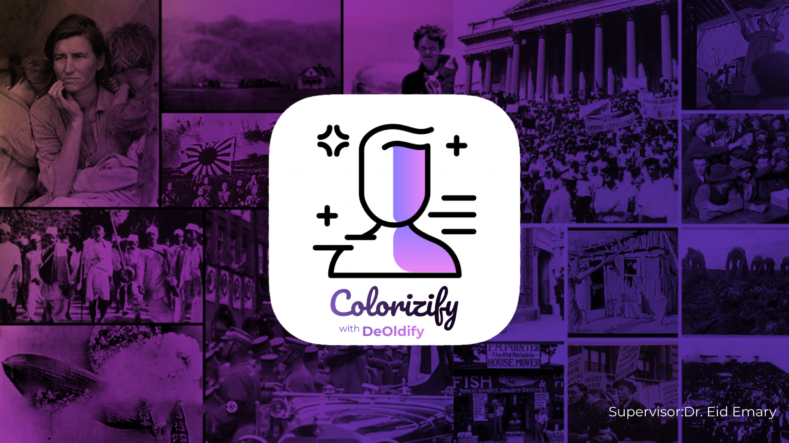
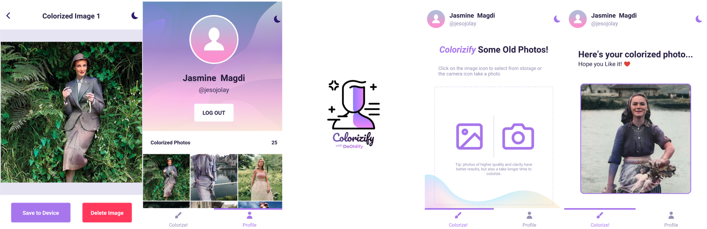

# Colorizify




An old photos colorization android app built with React Native by Yasmin Fahmi, integrated with the [DeOldify](https://github.com/jantic/DeOldify) deep learning model by Jason Antic.


## Screenshots




## Getting Started

These instructions will get you a copy of the project up and running for development and testing purposes on your local machine.


### Development Prerequisites

Your machine needs to have these globally installed:

- [NodeJS](https://nodejs.org/en/)

- [Expo CLI](https://docs.expo.io/workflow/expo-cli/)

- [Expo app](https://play.google.com/store/apps/details?id=host.exp.exponent&hl=en) on your mobile device (preferably android)

  

### Installing

To install all required modules, open the command line inside the project folder and type:

```
$ npm install
```

When done, you’ll have a `node_modules` folder in the project.


### Running the development server

After following the above instructions, open the command line in the project folder and type:

```
$ npm start
#or expo start 
```

This will run the server on your localhost, and viola! you’re ready to start development.


## Documentation 

You can view the app’s code documentation [here](docs/index.html).


## Deployment

When you’re done with the development, you can build the app binaries (and convert to APK) using expo with this command

```
$ expo build:android
```

read more about this process [here](https://docs.expo.io/distribution/building-standalone-apps/).


## Built With

* [React Native](https://reactnative.dev/) The framework used

* [DeOldify](https://github.com/jantic/DeOldify) The deep learning colorization model

  

## Author

* **Yasmin Magdi Fahmi** -  Id : 1751710907 AOU

  

## License

This project is licensed under the MIT License - see the [License.md](./License.md) file for details


## Acknowledgments

* Jason antic for the wonderful model
* Dr. Eid Emary, my project supervisor
* Arab Open university - Egypt
